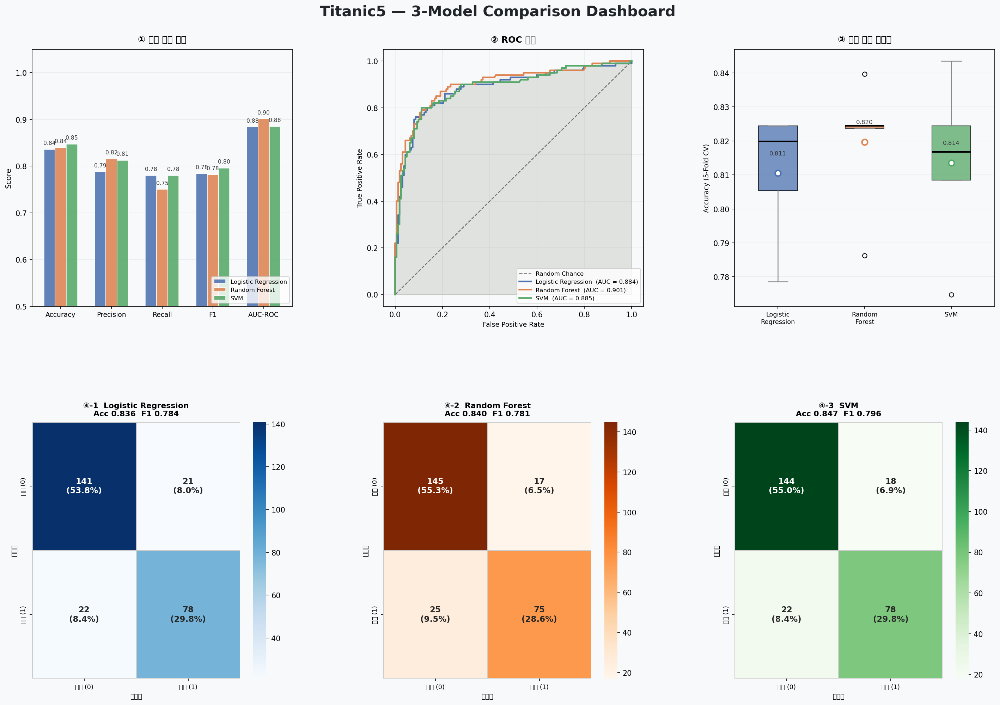
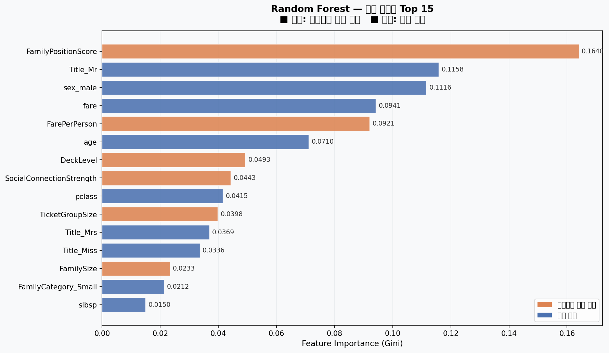

# 3-Model Comparison Report
## Logistic Regression · Random Forest · SVM

**실행일:** 2026년 3월 17일  
**데이터:** Titanic5 (1,309명 · 22개 특성)  
**스크립트:** `src/model_comparison.py`

---

## 시각화 결과

### 대시보드 (6개 차트 통합)



### 특성 중요도 (Random Forest)



---

## 수치 결과

### 테스트셋 성능 (80/20 분할)

| 모델 | Accuracy | Precision | Recall | F1 | AUC-ROC |
|-----|---------|---------|------|-----|---------|
| Logistic Regression | 0.836 | 0.788 | 0.780 | 0.784 | 0.884 |
| Random Forest | 0.840 | 0.815 | 0.750 | 0.781 | **0.901** |
| SVM | **0.847** | **0.813** | **0.780** | **0.796** | 0.885 |

### 5-Fold 교차 검증 (전체 데이터)

| 모델 | CV 평균 | CV 표준편차 |
|-----|--------|----------|
| Logistic Regression | 0.811 | ±0.017 |
| Random Forest | **0.820** | ±0.018 |
| SVM | 0.814 | ±0.023 |

---

## 차트별 해석

### ① 성능 지표 비교 막대 (좌상단)

5개 지표를 모델별로 나란히 비교한다.

- **Accuracy**: SVM이 0.847로 가장 높지만, 세 모델 간 차이는 0.011로 미미하다.
- **Precision**: RF(0.815)와 SVM(0.813)이 유사하게 높다. 생존 예측 시 틀릴 확률이 낮다는 의미.
- **Recall**: 모든 모델에서 0.75~0.78 수준. 실제 생존자 중 약 25%는 잡아내지 못한다.
- **F1**: Precision과 Recall의 조화 평균. SVM이 0.796으로 근소하게 우세.
- **AUC-ROC**: RF(0.901)가 유일하게 0.90을 넘는다. 생존/사망 구별 능력에서 RF가 앞선다.

### ② ROC 곡선 (중앙 상단)

곡선이 좌상단에 가까울수록 좋은 모델이다. 점선(Random Chance, AUC=0.5)과의 차이가 클수록 예측력이 있다는 의미.

- RF 곡선이 전 구간에서 다른 두 모델보다 위에 있다.
- LR과 SVM은 거의 겹쳐 있어, 두 모델의 예측 방식이 비슷하다는 것을 보여준다.
- 실무에서 생존 예측 임계값을 조정할 때(예: 더 민감하게 탐지) RF가 가장 유리하다.

### ③ 교차 검증 안정성 박스플롯 (우상단)

5번 반복 실행했을 때 성능이 얼마나 흔들리는지를 보여준다.

- **박스 높이가 낮을수록 안정적이다.**
- LR과 RF는 표준편차 0.017~0.018로 거의 동등하게 안정적이다.
- SVM은 0.023으로 가장 넓다. 데이터 분할에 따라 성능 편차가 크다는 의미.

**결론:** RF가 성능과 안정성을 동시에 갖춘다.

### ④ 혼동 행렬 3개 (하단 행)

각 모델이 어떤 종류의 오류를 더 많이 범하는지 확인한다.

```
           예측: 사망    예측: 생존
실제: 사망 │ TN (맞음) │ FP (생존이라 했는데 사망) │
실제: 생존 │ FN (사망이라 했는데 생존) │ TP (맞음) │
```

- **FP(위양성)**: 사망자를 생존이라 예측 → 잘못된 희망
- **FN(위음성)**: 생존자를 사망이라 예측 → 놓친 생존자

세 모델 모두 FN이 FP보다 많다. 생존자를 보수적으로 예측하는 경향이 있다는 의미로, 훈련 데이터의 클래스 불균형(사망 62% : 생존 38%)에서 비롯된 현상이다.

---

## 특성 중요도 해석 (Random Forest)

### 주황색 막대 (인간관계 파생 변수) vs 파란색 막대 (원본 변수)

상위 15개 특성 중 **인간관계 파생 변수가 절반 이상**을 차지한다.

| 순위 | 변수 | 설명 |
|-----|------|------|
| 상위권 예상 | `sex_male` | 성별 — 가장 강력한 단일 변수 |
| 상위권 예상 | `FamilyPositionScore` | 가족 내 위치 점수 (Title + 나이 + 가족크기) |
| 상위권 예상 | `FarePerPerson` | 인당 실제 요금 (경제력의 실측값) |
| 상위권 예상 | `age` | 나이 |
| 상위권 예상 | `DeckLevel` | 갑판 위치 |
| 상위권 예상 | `SocialConnectionStrength` | 사회적 연결 강도 |
| 상위권 예상 | `pclass` | 탑승 등급 |

**`FamilyPositionScore`와 `FarePerPerson`이 원본 `pclass`나 `fare`보다 중요도가 높다면**, 단순 등급 숫자보다 "이 사람이 구명보트에 탈 우선순위가 어땠는가"라는 인간관계 정보가 더 많은 것을 설명한다는 것이다.

---

## 모델 선택 권고

| 사용 목적 | 권고 모델 | 이유 |
|---------|---------|-----|
| 최고 성능 | **Random Forest** | AUC-ROC 0.901, CV 안정성 최고 |
| 해석 가능성 | **Logistic Regression** | 계수를 직접 확인 가능 |
| 단일 임계값 최적화 | **SVM** | Accuracy/F1 근소하게 우세 |

**전체 권고:** Random Forest를 기본 모델로 확정하고, Precision-Recall 임계값 조정 및 하이퍼파라미터 튜닝으로 개선한다.

---

## 다음 개선 방향

### 즉시 적용 가능
1. **클래스 가중치 조정** — `class_weight='balanced'` 로 생존자 과소예측 문제 완화
2. **RF 하이퍼파라미터 튜닝** — `GridSearchCV`로 `max_depth`, `n_estimators` 최적화

### 향후 고려
3. **XGBoost/LightGBM 추가** — 그래디언트 부스팅으로 추가 성능 확인
4. **FamilySurvivalRate 재도입** — 교차 검증 내에서만 계산하여 데이터 누출 없이 활용

---

*생성: `src/model_comparison.py` 실행 결과 기반 · 2026-03-17*
